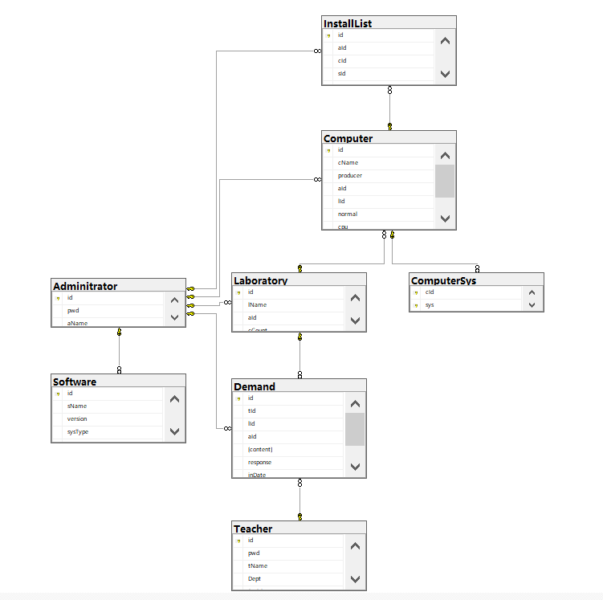

# 机房管理系统-用户文档
[TOC]
## 数据库设计
使用**sql server**作为本次项目的数据库   
**ER图**

---
## 数据表说明

### Admintrator
管理员信息表，基本表
- id CHAR(16): 主键，管理员id，使用教职号作为唯一标识
- pwd CHAR(128): 管理员密码，使用hash进行散列，减轻密码泄露风险，由于散列的字符串比较长，所以使用128的长度
- aName NVARCHAR(32): 管理员姓名，unicode字符串

### Teacher
教师信息表，基本表
- id CHAR(16): 主键，教师id，使用教职号作为唯一标识
- tName: 教师姓名
- pwd CHAR(128): 教师密码，使用hash进行散列，减轻密码泄露风险，由于散列的字符串比较长，所以使用128的长度
- Dept NVARCHAR(64): 院系，有点院系名比较长，所以设置长一点
- Positon NVARCHAR(8): 教职

### Demand
需求表，基本表
- id CHAR(32): 主键，用于唯一标识需求，使用 "d+日期+序号"作为id
- tId CHAR(16): 外键，依附Teacher.id，如果该老师id账号注销，该需求将被删除
- aId CHAR(16): 如果不为空，则说明该demand被受理
- content NVARCHAR(max): 需求内容不超过256字
- response NVARCHAR(max): 管理员回复不超过256字
- inDate DATE: 提交时间
- closeDate DATE: 解决时间

### Laboratory
实验室表，基本表
- id CHAR(16): 主键，实验室id
- lName NVARCHAR(32): 实验室名
- aId CHAR(16): 登记该实验室管理员的id
- cCount INTEGER: 最大容纳电脑数

### Computer
入库电脑表，基本表
- id CHAR(32): 主键，电脑id，使用"c+登记日期+序号"作为id
- cName NVARCHAR(16): 电脑名
- producer NVARCHAR(16): 出厂商
- aId CHAR(16): 外键，Adminitrator.id，如果管理员被注销，该键置空
- lId CHAR(16): 外键，Laboratory.id，如果实验室被删除，该键置空，被认为闲置
- normal BIT: 电脑正常与否，0异常，1正常
- cpu CHAR(3): 电脑cpu等级，用于排序
- mm TINYINT: 电脑主存大小，最大256

### InstallList
软件安装信息表，多对多关系
- id CHAR(32): 主键，使用"i+登记日期+序号"作为id
- aId CHAR(16): 外键，Adminitrator.id，管理员id，如果管理员注销，该键置空
- sId CHAR(32): 外键，Software.id，软件id，如果软件注销，该实体删除
- sys CHAR(16): 适用的系统

### ComputerSys
用于标识电脑已经装有的系统表，多对多关系
- cId CHAR(32): 电脑id
- sys CHAR(32): 电脑装有的系统
- 联合主键(cId,sys)

## 功能说明
以下以用户角色对功能进行说明  

### 管理员Admin

- 实验室管理   

包括实验室的增删查改，因为功能中会涉及到实验室的电脑配置，软件配置等，所以此处涉及的数据表有：Laboratory,Computer,Software  
实验室信息可以在首页进行查看   

- 软件管理  

考虑软件入库功能使用频繁，显式地表现在软件管理栏中
包括软件信息的增删查改，软件的信息可以在首页进行查看，在首页中实现删除，筛选查找等操作，主要涉及表:Software  

- 电脑管理  

包括了电脑信息的增删查改，由于电脑中可安装不同的系统，所以功能主要涉及表:Computer ，ComputerSys

- 需求管理  

- 用户管理
